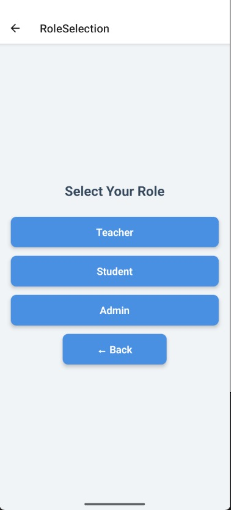

# DigiSchool - School Management System

This is a **React Native** project developed as a college project by a group of three members:  
- **Vivek**  
- **Deepanshu Baghel**  
- **Satya Prakesh**

The project, named **DigiSchool**, is a **School Management System** that includes features such as:  
- Student attendance tracking  
- Scheduling tests  
- Managing school events  
- And many more functionalities!

---

## Getting Started

> **Note**: Make sure you have completed the [Set Up Your Environment](https://reactnative.dev/docs/set-up-your-environment) guide before proceeding.

### Installation

1. Clone the repository:
   ```sh
   git clone https://github.com/webdeveloperdesigner/DigiSchool.git
   cd DigiSchool
   ```

2. Install dependencies:
   ```sh
   npm install
   ```

3. For iOS, install CocoaPods dependencies (only for macOS):
   ```sh
   bundle install
   bundle exec pod install
   ```

---

### Starting the Project

1. Start the Metro dev server:
   ```sh
   npm start
   ```

2. Build and run the app:

   #### Android
   ```sh
   npm run android
   ```

   #### iOS
   ```sh
   npm run ios
   ```

   If everything is set up correctly, you should see the app running in the Android Emulator, iOS Simulator, or your connected device.

---

## Features

- **Student Attendance**: Track and manage student attendance records.  
- **Test Scheduling**: Schedule and manage tests for students.  
- **Event Management**: Organize and manage school events.  
- **User-Friendly Interface**: Easy-to-use interface for teachers and administrators.  

---

## Version

- **Current Version**: DS V0.0.4

---

### 📊 Version Status Table

| #   | Version       | GitHub Code       | Live Website       | Key Changes                                                                 |
|-----|---------------|-------------------|--------------------|------------------------------------------------------------------------------|
| 1   | DS V0.0.4     | 🔄 Coming Soon    | 🔄 Coming Soon     | Teacher's Dashboard with working Attendance Notice                          |
| 2   | DS V0.0.3     | ✅ Updated        | 🔄 Coming Soon     | New interface for each role after login, including a Teacher's Dashboard    |
| 3   | DS V0.0.2     | ✅ Updated        | 🔄 Coming Soon     | Added Home Screen, Role Interface (Admin, Student, Teacher), and Login Page |
| 4   | DS V0.0.1     | ✅ Updated        | 🔄 Coming Soon     | Initial release with core features                                          |

---

## Screenshots

### Home Screen
  
*Home Screen of the DigiSchool app.*

### Role Interface
  
*Role Section Screen of the DigiSchool app, showing interfaces for Admin, Student, and Teacher.*

### Login Page
  
*Different Login page for each role to accessing the DigiSchool app.*

### Attendance Feature
  
*Attendance tracking feature 🔄 Coming Soon.*

---

## Modify the App

Once the app is running, you can modify it by editing `App.tsx`. Changes will automatically reflect in the app, thanks to [Fast Refresh](https://reactnative.dev/docs/fast-refresh).

To forcefully reload the app:  
- **Android**: Press <kbd>R</kbd> twice or select **"Reload"** from the **Dev Menu** (<kbd>Ctrl</kbd> + <kbd>M</kbd> on Windows/Linux or <kbd>Cmd ⌘</kbd> + <kbd>M</kbd> on macOS).  
- **iOS**: Press <kbd>R</kbd> in the iOS Simulator.

---

## Troubleshooting

If you encounter any issues, refer to the [Troubleshooting Guide](https://reactnative.dev/docs/troubleshooting).

---

## Learn More

To learn more about React Native, check out the following resources:

- [React Native Website](https://reactnative.dev)  
- [Getting Started](https://reactnative.dev/docs/environment-setup)  
- [Learn the Basics](https://reactnative.dev/docs/getting-started)  
- [Blog](https://reactnative.dev/blog)  
- [`@facebook/react-native`](https://github.com/facebook/react-native)  

---

## Contributors

- **[Vivek](https://github.com/webdeveloperdesigner)**  
- **[Deepanshu Baghel](https://github.com/Deepanshu-Baghel)**  
- **[Satya Prakesh](https://github.com/satyaprakash148)**
